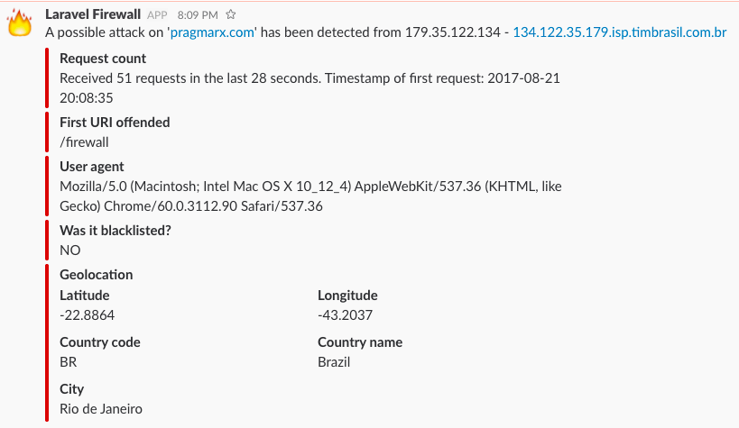

# Firewall

A firewall is a system that is designed to prevent unauthorized access. It monitor and  
control incoming and outgoing traffic based on a predefined set of rules.
A firewall eliminates hackers and threats. It protects the network and systems for unauthorized access.


## Task of firewall
*   Regulate the flow of traffic.
*   Block malicious programs.
*   Inform about malicious websites.
*   Inform about malicious activity in the network.
*   Monitoring of the nodes.

## How does a firewall work?

firewall uses a combination of **three** sets of rules to filter out the data packets.

#### Packet filtering
In packets filtering, a firewall uses the basic sets of predefined rules set by the administrator. If the data packets satisfy the conditions, then only they are allowed in a private network. 
#### Proxy service
A proxy is an application that operates on the application layer of the OSI model.
In proxy service, both client and server are connected to a session and thus centralize all information transfer for an activity to the firewall for scanning.
#### Stateful inspection

This is the most modern method for the prevention of unauthorized access. It does not rely on intensive memory inspection.

In stateful inspection, it holds the information of an incoming and outgoing request such as IP address and port numbers it also monitors the sequence of data packets to filter out the request.

##  Types of firewall

There are **two** types of firewalls.
#### Host-based firewall
In a host-based firewall, the software is being installed in a device and it only protects that device.
Usually, they come with software like antivirus, operating systems, and third-party applications.
#### Network-based firewall
They are installed on the network.
They protect the whole network of any malicious activity and threats.
They use packet filtering to identify the threats by analyzing source and destination IP addresses and port numbers.


## Access control list
**The access control list is managed by the network administrator. The rules can be modified as per requirement.**
```
```
| Permission        | IP Address           | Protocols  | Destination  | Port  |
| ------------- |:-------------:|:-------------:|:-------------:| -----:|
| Allow      | 162.213.214.14 | TCP | 10.10.10.2 | 80 |
| Allow      | 154.21.66.112      |   TCP |ANY |80 |
| Deny | 192.168.1.1      |    TCP |ANY|80 |
| Deny | ANY      |    TCP |ANY |80 |
| Allow | ANY      |    TCP |ANY | 80|
| Deny | ANY      |    TCP |ANY |23 |
| Deny | 255.255.255.0      |    UDP |10.10.10.1 |25 |
| Allow | 10.10.0.1      |    TCP |ANY |110 |
```
```


## Attack Detection
In this image, we can clearly see that 51 requests are received in just 28 seconds, which is unusual that can be easily identified.




## Conclusion
*  Keep your software updated, Use antivirus for protections never disable your firewall.
*  If you have more defensive lines then it is harder for the attacker to penetrate into the network.
*  Always use genuine software and always buy them from authorized portals.
*  Never Share Your network-related information to anyone.
*  A firewall protects you from any threats and unauthorized access.

## References
1. [https://www.youtube.com/watch?v=eO6QKDL3p1I&list=PLBbU9-SUUCwV7Dpk7GI8QDLu3w54TNAA6](https://www.youtube.com/watch?v=eO6QKDL3p1I&list=PLBbU9-SUUCwV7Dpk7GI8QDLu3w54TNAA6).
2. [https://www.youtube.com/watch?v=kDEX1HXybrU](https://www.youtube.com/watch?v=kDEX1HXybrU).
3. [https://blog.eccouncil.org/everything-you-need-to-know-about-firewalls-and-everything-to-avoid/](https://blog.eccouncil.org/everything-you-need-to-know-about-firewalls-and-everything-to-avoid/)
4. [https://www.swissns.ch/site/2016/11/the-role-played-by-a-firewall-in-network-security/](https://www.swissns.ch/site/2016/11/the-role-played-by-a-firewall-in-network-security/)
5. [https://www.controleng.com/articles/firewall-functions-and-roles-for-company-security/](https://www.controleng.com/articles/firewall-functions-and-roles-for-company-security/)
